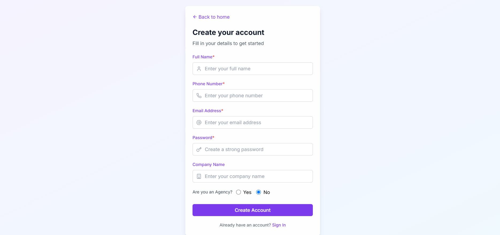
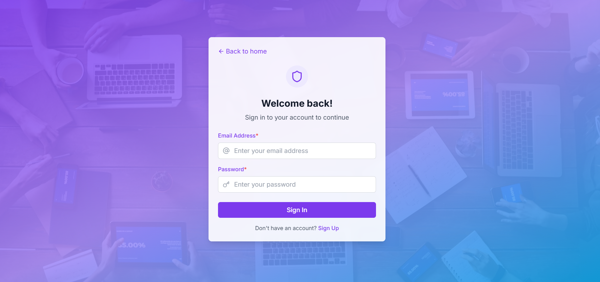

# 🔐 React Authentication Web App

## 📋 Description

This is a responsive React-based authentication web application that allows users to create an account, log in, and manage their profile. The application features form validation, local data storage, and smooth navigation between pages for an intuitive user experience.

## 🔗 Live Demo

> [Click here to view the live app](https://project-edu-txgm.onrender.com) 

---

## 🚀 Features

- Home page with welcome message and navigation options
- Sign Up page with fields: Name, Phone, Email, Password, and Company
- Sign In page with email and password fields
- Account Settings page with user image, details, and logout functionality
- Input validation on both sign up and login
- LocalStorage-based user data simulation
- Responsive design for all screen sizes

## 🛠️ Built With

- **React.js** – For creating dynamic UI components
- **React Router DOM** – For routing and navigation
- **Tailwind CSS** – For responsive styling
- **JavaScript (ES6+)** – For logic and validation
- **LocalStorage** – For client-side data storage
- **Vite** – For lightning-fast builds and development
- **Render** – For deployment

## 🖼️ Project Screenshots

### 🏠 Homepage

### 📝 Sign Up Page

### 🔐 Sign In Page

### ⚙️ Account Settings Page

